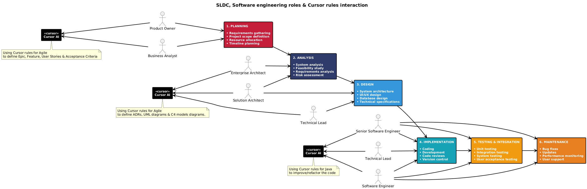
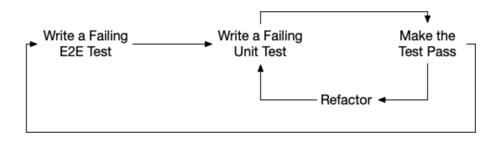
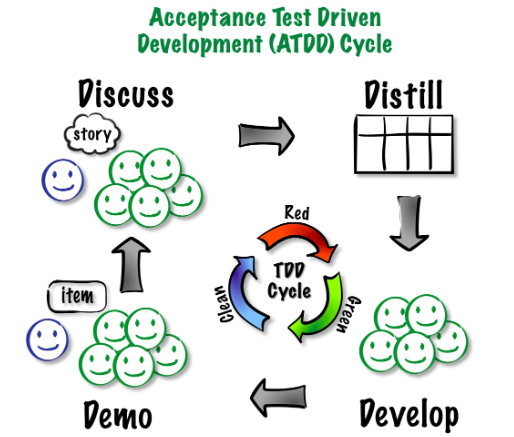

# Cursor rules examples

## Motivation

Probe that using **Cursor rules for Agile & Java** are useful when the Software Engineer have to face non trivial Java problems.

## Getting started

### 1. Review the Latency problems

- https://github.com/jabrena/latency-problems

### 2. Onboarding

Intall the cursor rules which you are going to use in your workspace

```bash
sdk install jbang
jbang --fresh setup@jabrena
jbang setup@jabrena init --cursor https://github.com/jabrena/cursor-rules-agile
```

### 3. Requirements discovery

Generate the software requirements based on the initial problem description



```bash
Create an agile development checklist using @2000-agile-checklist
```

**Note:** The Cursor rules for Agile could help several roles: `EA`, `PO`, `BA`, `SA`, `TL`, `SSE` & `SE`.

**Note:** Using the Cursor rules for agile, the implementation phase and the models provided by Cursor will have better context information to be used in the implementation & testing phase.

### 4.Implement the solution

- 4.1 Setup the Maven project

Depending of the requirements and the requirements will use one command or another:

```bash
jbang setup@jabrena init --maven
jbang setup@jabrena init --spring-boot
jbang setup@jabrena init --quarkus
```

- 4.2 Implement the Acceptance test ([Outside-in TDD London](https://outsidein.dev/concepts/outside-in-tdd/)) based on the Gherkin file described in the implementation.



**Note:** Attach the User story & Gherkin file from requirements folder

```bash
Implement an acceptance tests in the package info.jab.latency for the scenarios
Don´t develop any source code, only implement the acceptance test.
It will fail because in this phase, doesn´t exist any implemention.
```



- 4.3 Implement the solution to pass the acceptance tests

```bash
Implement a solution in the package info.jab.latency from src.
Create a solution and later add test classes.
Dont´t change the acceptance tests.
Verify the changes with the command: ./mvnw clean verify
```

- 4.3 Implement the solution to pass the acceptance tests

**Note:** At the end of this phase, the development should build with `./mvnw clean verify` and at runtime the solution will work.

- 4.4 Implement the rest of the requirements.

**Note:** Follow [the task list](./problem5/requirements/agile/US-001-tasks-api-greek-gods-data-retrieval.md) in orther to build the solution in a incremental way.

### 5.Refactoring

- 5.1 Increase the Code coverage

Review current state with:

```bash
./mvnw clean verify jacoco:report -Pjacoco
jwebserver -p 8002 -d "$(pwd)/target/site/jacoco"
```

And improve the test coverage:

```bash
Review the coverage with ./mvnw clean verify jacoco:report -Pjacoco and increase the coverage in instructions, classes & branches until 80% @problem4
```

- 5.2 Refactor the initial stable solution

Review current implementation to have a high level view what is the current implementation:

```bash
Create the UML diagram based on @example/implementation/src/main/java using the cursor rule @2200-uml-class-diagram.mdc
```

Generate the png files on fly with the following utility:

```bash
jbang --fresh puml-to-png@jabrena
jbang puml-to-png@jabrena --watch problem5/requirements
```

**Note:** Review all files if something is possible to be simplified.

- 5.3 Enrich the solution

Install the specific cursor rules for Java

```bash
jbang setup@jabrena init --cursor https://github.com/jabrena/cursor-rules-java
#TODO: Create a checklist for the java cursor rules
```

**Note:** No recipe, this is the added value of a good SSE. ¯\_(ツ)_/¯```

Enjoy in the refactoring process

## References

- https://editor-next.swagger.io/
- https://www.plantuml.com/plantuml/uml/
- https://cekrem.github.io/posts/double-loop-tdd-blog-engine-pt2/
- ...
- https://github.com/jabrena/cursor-rules-methodology
- https://github.com/jabrena/cursor-rules-agile
- https://github.com/jabrena/cursor-rules-java
- https://github.com/jabrena/cursor-rules-examples
- https://github.com/jabrena/latency-problems
- https://github.com/jabrena/101-cursor
- https://github.com/jabrena/setup-cli
- https://github.com/jabrena/jbang-catalog
