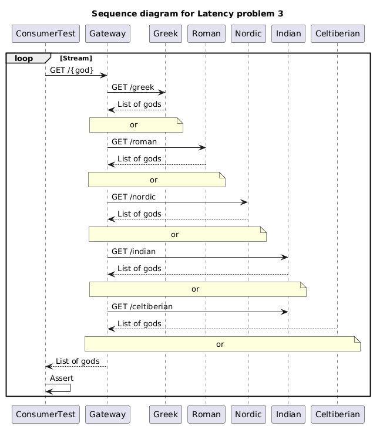

# Problem 3

God fans are using a new API to provide information about `GREEK`, `ROMAN`, `NORDIC`, `INDIAN` or `CELTIBERIAN` gods.
It is important that the interface support Concurrent access to the API. Provide a Test that ensure that in a Concurrent scenario, the information retrieved is `Thread Safe`.

**Notes:**

- Review the timeout for Every connection.
- REST API 1: https://my-json-server.typicode.com/jabrena/latency-problems/greek
- REST API 2: https://my-json-server.typicode.com/jabrena/latency-problems/roman
- REST API 3: https://my-json-server.typicode.com/jabrena/latency-problems/nordic
- REST API 4: https://my-json-server.typicode.com/jabrena/latency-problems/indian
- REST API 5: https://my-json-server.typicode.com/jabrena/latency-problems/celtiberian

