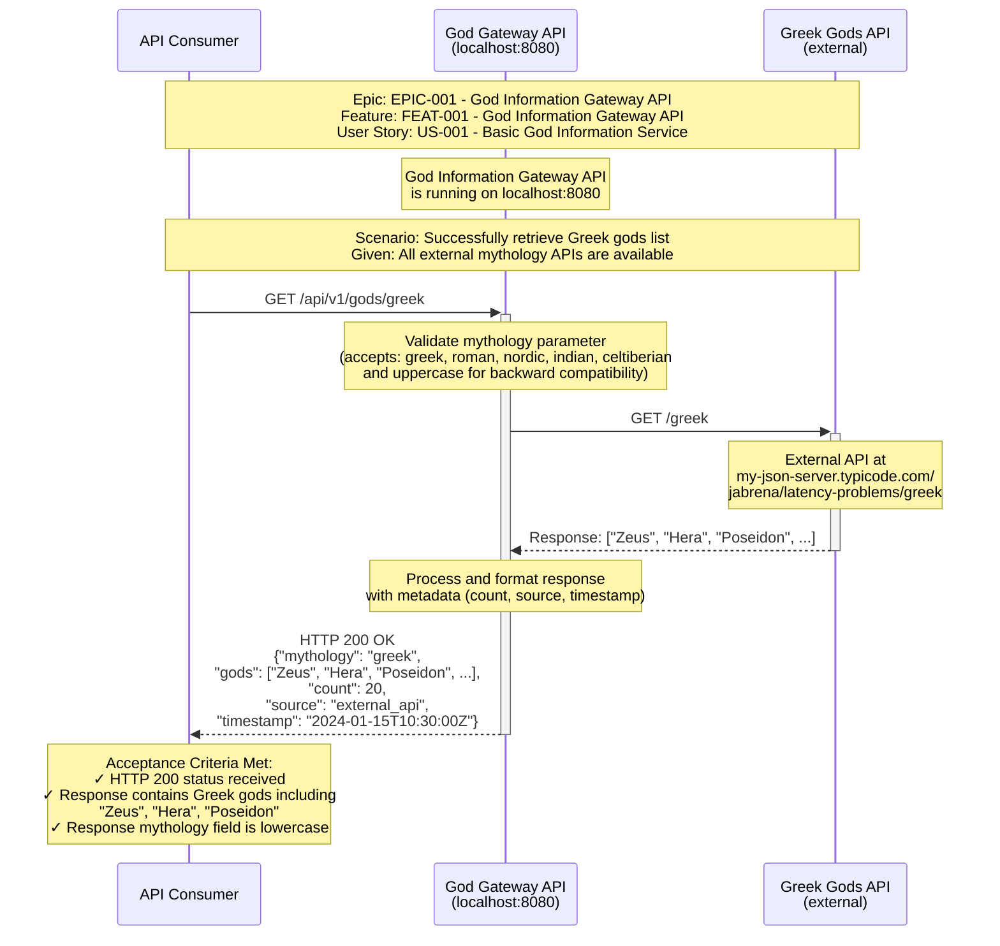
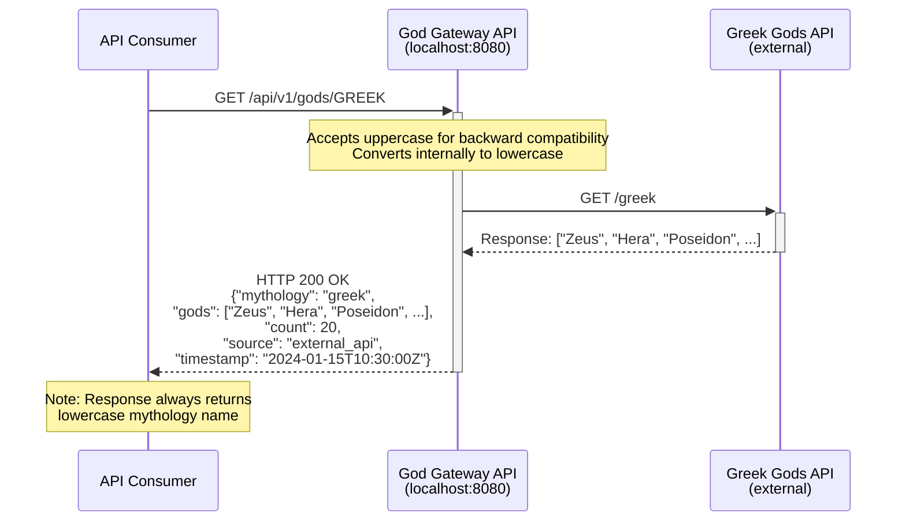
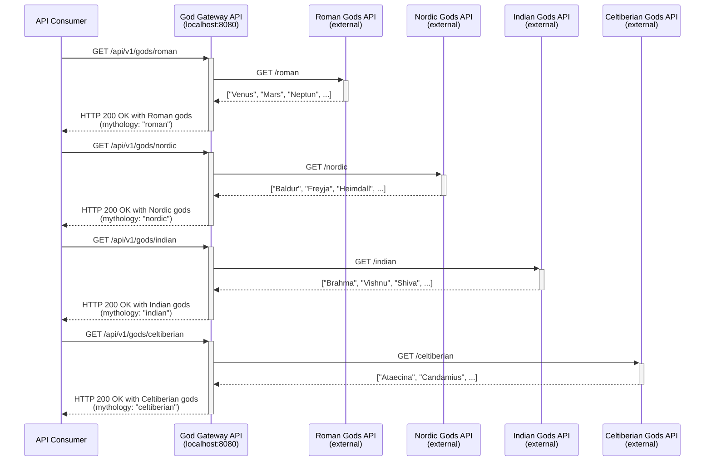
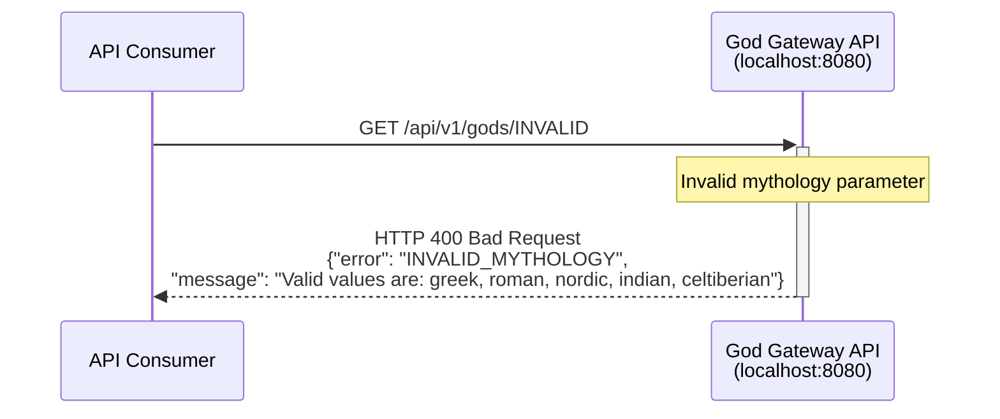
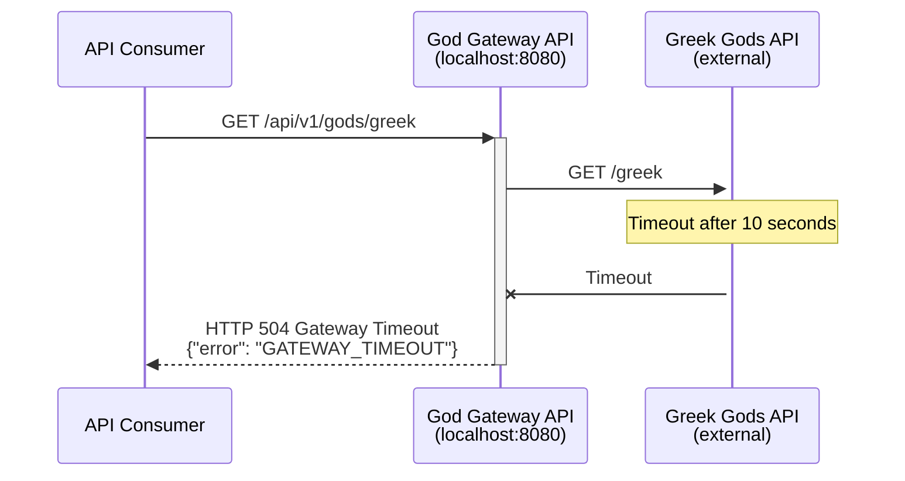
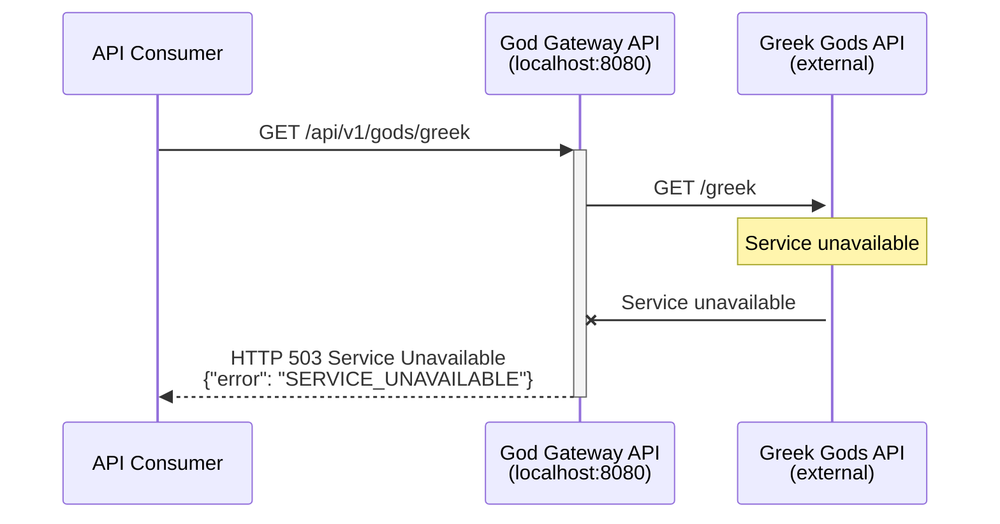

# God Information Gateway Service - Sequence Diagram

This document describes the sequence flow for the God Information Gateway Service, which provides access to mythology data from multiple external sources through a unified API.

## Epic and User Story Context

- **Epic:** EPIC-001 - God Information Gateway API
- **Feature:** FEAT-001 - God Information Gateway API
- **User Story:** US-001 - Basic God Information Service

## System Overview

The God Information Gateway Service acts as a proxy/gateway to aggregate mythology data from five external APIs:
- Greek Gods API
- Roman Gods API
- Nordic Gods API
- Indian Gods API
- Celtiberian Gods API

All external APIs are hosted at: `https://my-json-server.typicode.com/jabrena/latency-problems/`

## Main Success Scenario: Retrieve Greek Gods



## Backward Compatibility: Uppercase Parameters



## Alternative Flows: Other Mythologies



## Error Scenarios

### Invalid Mythology Parameter



### Timeout Scenario



### Service Unavailable Scenario



## Key Implementation Details

- **Gateway Architecture**: Aggregates from 5 external APIs
- **Timeout Configuration**: 10-second timeout for all external connections
- **External API Base URL**: `https://my-json-server.typicode.com/jabrena/latency-problems/`
- **Technology Stack**: Spring Boot microservice architecture
- **Concurrency**: Thread-safe concurrent access support
- **Backward Compatibility**: Accepts both lowercase and uppercase mythology parameters

## Supported Mythologies

| Parameter | External Endpoint | Example Gods |
|-----------|------------------|--------------|
| `greek` | `/greek` | Zeus, Hera, Poseidon |
| `roman` | `/roman` | Venus, Mars, Neptun |
| `nordic` | `/nordic` | Baldur, Freyja, Heimdall |
| `indian` | `/indian` | Brahma, Vishnu, Shiva |
| `celtiberian` | `/celtiberian` | Ataecina, Candamius |

## Response Format

### Success Response

```json
{
  "mythology": "greek",
  "gods": ["Zeus", "Hera", "Poseidon", "..."],
  "count": 20,
  "source": "external_api",
  "timestamp": "2024-01-15T10:30:00Z"
}
```

### Error Responses

#### Invalid Mythology (400 Bad Request)
```json
{
  "error": "INVALID_MYTHOLOGY",
  "message": "Valid values are: greek, roman, nordic, indian, celtiberian"
}
```

#### Gateway Timeout (504)
```json
{
  "error": "GATEWAY_TIMEOUT"
}
```

#### Service Unavailable (503)
```json
{
  "error": "SERVICE_UNAVAILABLE"
}
```

## Acceptance Criteria

- ✅ HTTP 200 status received for valid requests
- ✅ Response contains expected gods for each mythology
- ✅ Response mythology field is always lowercase
- ✅ Backward compatibility with uppercase parameters
- ✅ Proper error handling for invalid parameters
- ✅ Timeout handling for slow external services
- ✅ Service unavailable handling for failed external services
