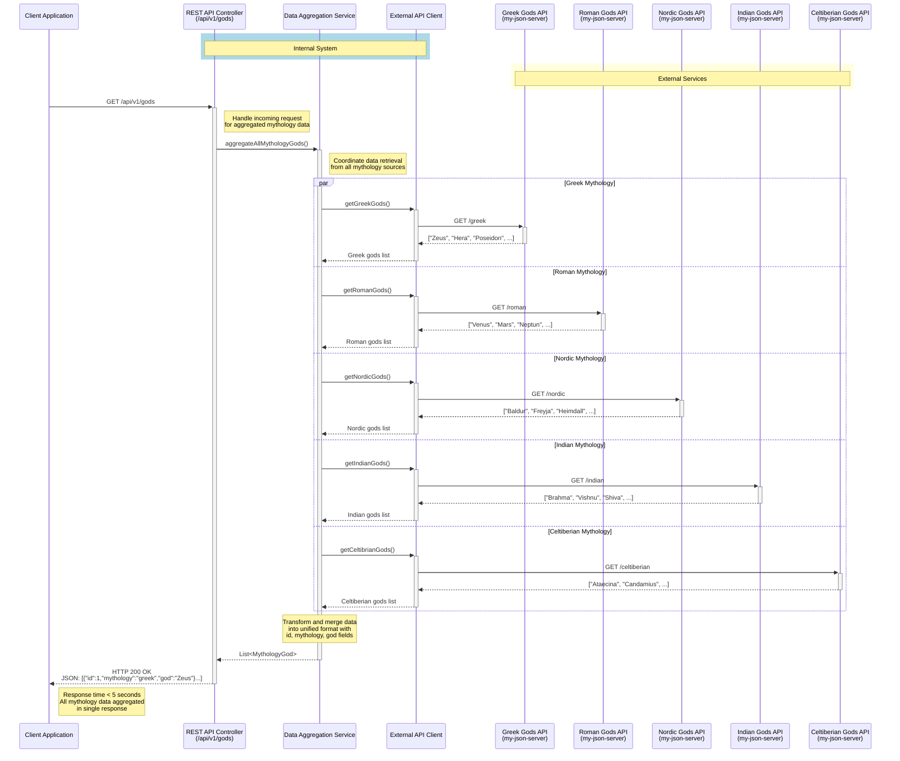
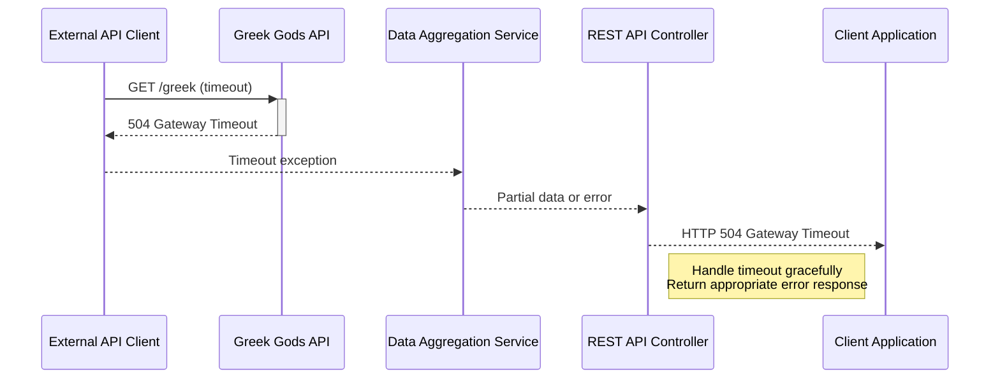
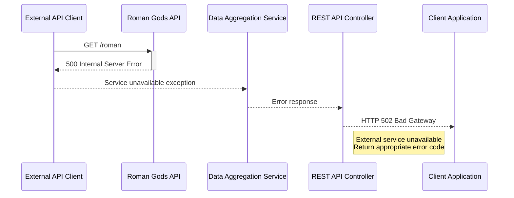

# Multi-Mythology Gods API Sequence Diagram

This document describes the sequence flow for the Multi-Mythology Gods Data Aggregation API, which retrieves and aggregates god data from multiple mythology sources.

## System Overview

The API aggregates mythology data from five different sources:
- Greek Gods API
- Roman Gods API
- Nordic Gods API
- Indian Gods API
- Celtiberian Gods API

## Sequence Diagram



## Error Handling Scenarios

### Timeout Scenario



### Service Unavailable Scenario



## Key Features

- **Parallel Processing**: All external API calls are made concurrently to minimize response time
- **Data Transformation**: Raw API responses are transformed into a unified format
- **Error Handling**: Graceful handling of timeouts and service unavailability
- **Performance**: Target response time under 5 seconds
- **Unified Response**: Single JSON response containing all mythology data

## Response Format

The API returns a unified JSON structure:

```json
[
  {
    "id": 1,
    "mythology": "greek",
    "god": "Zeus"
  },
  {
    "id": 2,
    "mythology": "roman",
    "god": "Venus"
  }
]
```
