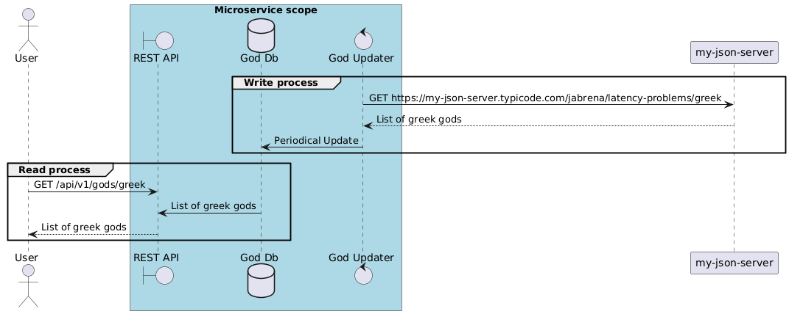

# Problem

Develop a REST API which read Greek god data which it is synchronized periodically from a third party service.

## UML Sequence diagram

## C4 Model

# Database Schema

[SQL Schema](./schema.sql)