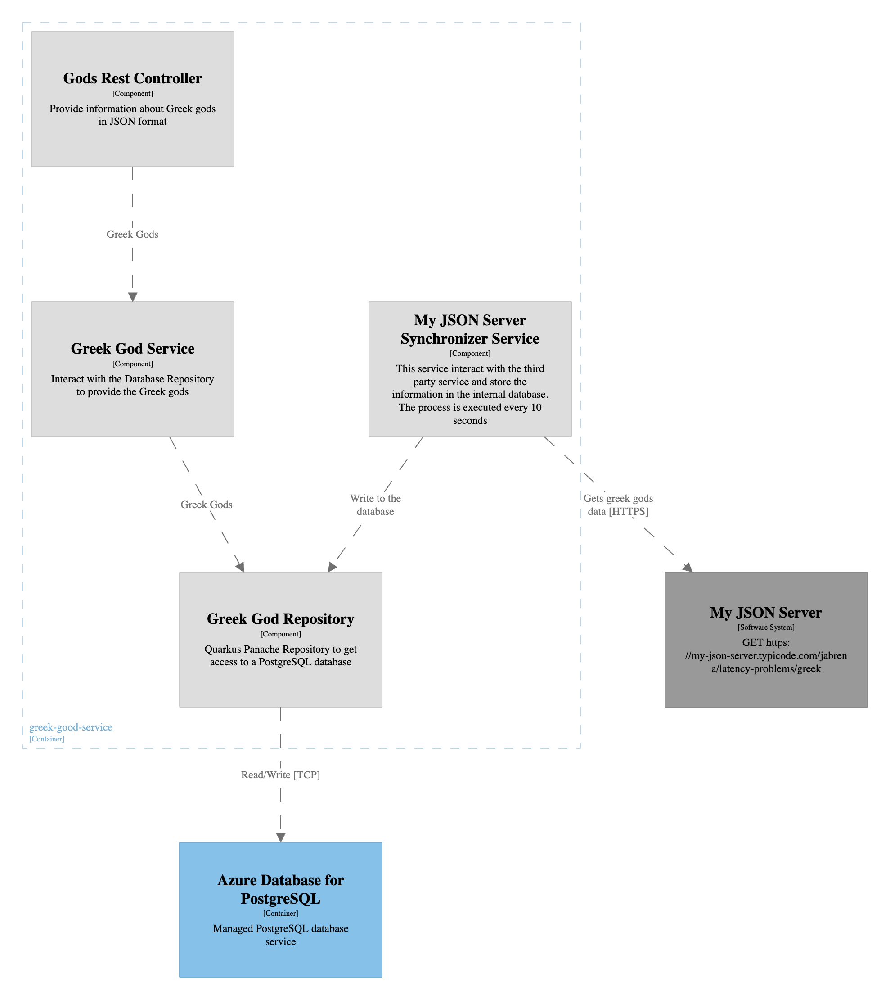

# Problem

Develop a REST API which read Greek god data which it is synchronized periodically from a third party service.

## UML Sequence diagram

## C4 Model

## Database Schema

[SQL Schema](./schema.sql)

## Open API

- [Public REST API](./greekController-oas.yaml)
- [Third Party Service](./my-json-server-oas.yaml)

## Links of interest

- https://editor-next.swagger.io/