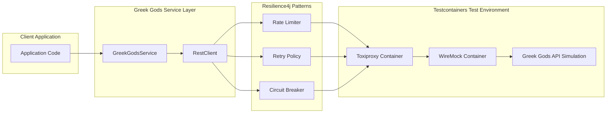

# Problem 6: Greek Gods REST Client Resilience Implementation Plan

## Requirements Summary

**User Story:** As a developer integrating with the Greek gods REST API, I want to call the Greek gods REST service with rate limiting, retry, and circuit breaker policies on those HTTP calls so that the client remains stable under latency and failures while returning all gods whose names start with `a`.

**Key Business Rules:**
- **Resilience Patterns:** Must implement rate limiting, retry policies, and circuit breaker patterns
- **Data Filtering:** Return only Greek gods whose names start with 'a'
- **Graceful Degradation:** Return empty list when resilience mechanisms trigger (no exceptions)
- **External API:** Consume `https://my-json-server.typicode.com/jabrena/latency-problems/greek`
- **Developer Experience:** Simple Spring service injectable via dependency injection
- **Testing Strategy:** Use Testcontainers to orchestrate Toxiproxy + WireMock for comprehensive failure simulation
- **Expected result:** Stable client that handles failures gracefully while maintaining resilience guarantees

## Approach

**Strategy:** London Style (Outside-In) TDD with single acceptance test for happy path, resilience patterns tested via integration tests using Testcontainers to orchestrate Toxiproxy + WireMock for comprehensive failure simulation.

**Architecture Flow:**



**Key Implementation Decisions:**
- Use RestClient (Spring 6.1+) for modern HTTP client capabilities
- Apply Resilience4j decorators using functional composition
- Configure resilience policies via Spring properties with sensible defaults
- Implement comprehensive test coverage using Testcontainers to orchestrate Toxiproxy + WireMock

## Task List

| # | Phase | Task | TDD | Status |
|---|-------|------|-----|--------|
| 1 | Setup | Update pom.xml with Resilience4j, Jackson, Testcontainers dependencies | | ✔ |
| 2 | Setup | Configure application.properties with resilience settings | | ✔ |
| 3 | Setup | Move Application.java from com.example.demo to info.jab.ms package | | ✔ |
| 4 | Setup | Verify build stability with `mvn clean compile` | | ✔ |
| 6 | RED | Write BaseIntegrationTest with Testcontainers setup | Test | ✔ |
| 7 | RED | Write acceptance test for happy path scenario only | Test | ✔ |
| 8 | GREEN | Create GreekGod domain record | Impl | ✔ |
| 9 | Verify | Run tests and verify build: `mvn clean test` | | ✔ |
| 10 | GREEN | Create GreekGodsResponse wrapper | Impl | ✔ |
| 11 | Verify | Run tests and verify build: `mvn clean test` | | ✔ |
| 12 | GREEN | Implement RestClient configuration bean | Impl | ✔ |
| 13 | Verify | Run tests and verify build: `mvn clean test` | | ✔ |
| 14 | GREEN | Implement GreekGodsService with basic HTTP call | Impl | ✔ |
| 15 | Verify | Run tests and verify build: `mvn clean test` | | ✔ |
| 16 | GREEN | Add filtering logic for gods starting with 'a' | Impl | ✔ |
| 17 | Verify | Run acceptance test and verify: `mvn clean test` | | ✔ |
| 18 | RED | Write unit test for service logic | Test | ✔ |
| 19 | GREEN | Apply Resilience4j rate limiter decorator | Impl | ✔ |
| 20 | Verify | Run all tests and verify: `mvn clean test` | | ✔ |
| 21 | GREEN | Apply Resilience4j retry decorator | Impl | ✔ |
| 22 | Verify | Run all tests and verify: `mvn clean test` | | ✔ |
| 23 | GREEN | Apply Resilience4j circuit breaker decorator | Impl | ✔ |
| 24 | Verify | Run all tests and verify: `mvn clean test` | | ✔ |
| 25 | GREEN | Implement graceful degradation (empty list on failures) | Impl | ✔ |
| 26 | Verify | Run all tests and verify: `mvn clean test` | | ✔ |
| 27 | RED | Write integration tests for retry behavior with Testcontainers | Test | ✔ |
| 28 | RED | Write integration tests for circuit breaker scenarios with Testcontainers | Test | ✔ |
| 29 | RED | Write integration tests for timeout and latency scenarios with Testcontainers | Test | ✔ |
| 30 | RED | Write integration tests for HTTP error responses with Testcontainers | Test | ✔ |
| 31 | Refactor | Add comprehensive logging for resilience events | | ✔ |
| 32 | Verify | Run all tests and verify: `mvn clean test` | | ✔ |
| 33 | Refactor | Optimize configuration and error handling | | ✔ |
| 34 | Verify | Final verification with `mvn clean verify` | | ✔ |

## Execution Instructions

When executing this plan:
1. Complete the current task.
2. **Update the Task List**: set the Status column for that task (e.g., ✔ or Done).
3. **For GREEN tasks**: MUST complete the associated Verify task before proceeding.
4. **For Verify tasks**: MUST ensure all tests pass and build succeeds before proceeding.
5. Only then proceed to the next task.
6. Repeat for all tasks. Never advance without updating the plan.

**Critical Stability Rules:**
- After every GREEN implementation task, run the verification step
- All tests must pass before proceeding to the next implementation
- If any test fails during verification, fix the issue before advancing
- Never skip verification steps - they ensure software stability

**Important:** Follow London Style TDD discipline - write single happy path acceptance test first, then implement core functionality, then add resilience via integration tests.

## File Checklist

| Order | File | When (TDD) |
|-------|------|------------|
| 1 | `pom.xml` | Setup |
| 2 | `src/main/resources/application.properties` | Setup |
| 3 | `src/main/java/info/jab/ms/Application.java` | Setup — migrate from com.example.demo |
| 4 | `src/test/java/info/jab/ms/integration/BaseIntegrationTest.java` | RED — shared base class for containerized tests |
| 5 | `src/test/java/info/jab/ms/acceptance/GreekGodsAcceptanceTest.java` | RED — happy path acceptance test extending BaseIntegrationTest |
| 6 | `src/main/java/info/jab/ms/domain/GreekGod.java` | GREEN — domain model |
| 7 | `src/main/java/info/jab/ms/domain/GreekGodsResponse.java` | GREEN — response wrapper |
| 8 | `src/main/java/info/jab/ms/config/RestClientConfig.java` | GREEN — HTTP client config |
| 9 | `src/main/java/info/jab/ms/config/ResilienceConfig.java` | GREEN — resilience config |
| 10 | `src/main/java/info/jab/ms/service/GreekGodsService.java` | GREEN — main service |
| 11 | `src/test/java/info/jab/ms/service/GreekGodsServiceTest.java` | RED — unit tests |
| 12 | `src/test/java/info/jab/ms/integration/GreekGodsRetryIntegrationTest.java` | RED — retry scenarios extending BaseIntegrationTest |
| 13 | `src/test/java/info/jab/ms/integration/GreekGodsCircuitBreakerIntegrationTest.java` | RED — circuit breaker scenarios extending BaseIntegrationTest |
| 14 | `src/test/java/info/jab/ms/integration/GreekGodsTimeoutIntegrationTest.java` | RED — timeout and latency scenarios extending BaseIntegrationTest |
| 15 | `src/test/java/info/jab/ms/integration/GreekGodsHttp500Then200IntegrationTest.java`, `GreekGodsInvalidJsonIntegrationTest.java` | RED — HTTP / malformed JSON scenarios extending BaseIntegrationTest |

## Notes

**Package Layout:**
- `info.jab.ms.domain` - Domain models (GreekGod, GreekGodsResponse)
- `info.jab.ms.service` - Business logic (GreekGodsService)
- `info.jab.ms.config` - Configuration beans (RestClient, Resilience4j)

**Conventions:**
- Use Java Records for immutable domain objects
- Apply constructor injection for all dependencies
- Use @Service annotation for business logic components
- Configure resilience policies via application.properties
- Return empty collections instead of null values

**Package Migration:**
- Update existing `src/main/java/com/example/demo/Application.java` to `src/main/java/info/jab/ms/Application.java`
- Change package declaration from `com.example.demo` to `info.jab.ms`
- All new classes use `info.jab.ms` base package structure

**BaseIntegrationTest Design:**
- **@Testcontainers**: Enables Testcontainers lifecycle management
- **@SpringBootTest**: Provides full Spring context for integration testing
- **ToxiproxyContainer**: Network-level failure simulation container
- **GenericContainer**: WireMock container for HTTP response stubbing
- **Protected methods**: Utility methods for container interaction (getToxiproxy(), getWireMockUrl())
- **Setup/Teardown**: Container lifecycle management and network configuration
- **Inheritance**: Both acceptance and integration tests extend this base class

**Edge Cases:**
- Handle malformed JSON responses from external API
- Manage connection timeouts and read timeouts separately
- Ensure circuit breaker state transitions are logged
- Verify rate limiter doesn't block legitimate requests
- Test behavior when external API returns unexpected HTTP status codes

**Resilience Configuration:**
- Rate Limiter: 10 calls per second with 1 second refresh period
- Retry Policy: 3 attempts with exponential backoff (500ms, 1s, 2s)
- Circuit Breaker: 50% failure threshold, 10 second wait duration, 5 call minimum
- Timeouts: 5 second connect, 10 second read timeout

**Testing Strategy:**
- Single acceptance test verifies happy path end-to-end behavior with real Spring context using BaseIntegrationTest
- Unit tests focus on service logic with mocked dependencies
- Integration tests use BaseIntegrationTest with Testcontainers for comprehensive failure simulation
- All resilience scenarios from feature file covered via integration tests, not acceptance tests

**Testcontainers Integration Strategy:**
- **BaseIntegrationTest**: Shared base class providing Testcontainers setup for both acceptance and integration tests
- **Container Orchestration**: Testcontainers manages Toxiproxy and WireMock containers with proper networking
- **WireMock Container**: Provides HTTP response stubbing for controlled API responses (success, errors, malformed JSON)
- **Toxiproxy Container**: Simulates network-level conditions (latency, jitter, bandwidth limits, connection failures)
- **Network Architecture**: Client → Toxiproxy Container → WireMock Container → (simulated) External API
- **Container Benefits**: Isolated test environment, automatic cleanup, consistent networking, parallel test execution
- **Shared Infrastructure**: Both acceptance and integration tests inherit from BaseIntegrationTest for consistent setup

**Stability Verification Strategy:**
- After every GREEN implementation task, run `mvn clean test` to verify stability
- All existing tests must pass before proceeding to next task
- Build must succeed without compilation errors
- No regressions allowed - fix any failures immediately before advancing
- Final verification uses `mvn clean verify` to run all quality checks

**Dependencies to Add:**
```xml
<dependency>
    <groupId>io.github.resilience4j</groupId>
    <artifactId>resilience4j-spring-boot3</artifactId>
</dependency>
<dependency>
    <groupId>org.springframework.boot</groupId>
    <artifactId>spring-boot-starter-web</artifactId>
</dependency>
<dependency>
    <groupId>org.testcontainers</groupId>
    <artifactId>testcontainers</artifactId>
    <scope>test</scope>
</dependency>
<dependency>
    <groupId>org.testcontainers</groupId>
    <artifactId>junit-jupiter</artifactId>
    <scope>test</scope>
</dependency>
<dependency>
    <groupId>org.testcontainers</groupId>
    <artifactId>toxiproxy</artifactId>
    <scope>test</scope>
</dependency>
```

**Notes:** 
- AssertJ is already included with `spring-boot-starter-test` dependency, so no need to add it explicitly
- **Testcontainers**: Container orchestration and lifecycle management for integration tests
- **Toxiproxy Module**: Testcontainers module for Toxiproxy container with network failure simulation
- **WireMock Integration**: WireMock runs inside generic container managed by Testcontainers
- **Container Benefits**: Isolated test environment, automatic cleanup, consistent networking, parallel execution
